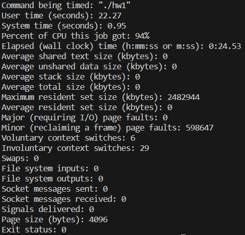
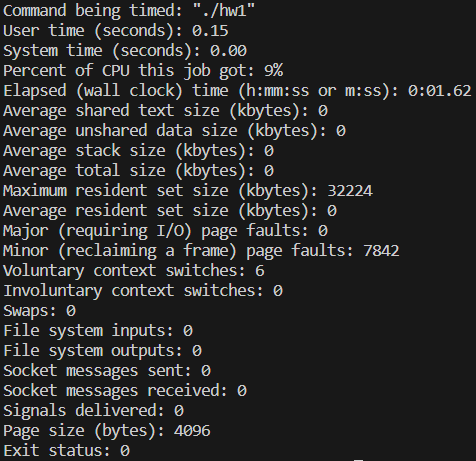

# EinStein würfelt nicht! (EWN)
EWN is a board game featuring schotastic process. Please refer to [Wikipedia](https://en.wikipedia.org/wiki/EinStein_w%C3%BCrfelt_nicht!) for more information.

In this project, the rules of EWN are slightly changed:
- Only one person is involved.
- A piece is allowed to move to all of eight directions.
- The goal is to move a specific piece to the given destination.

# How to run
- Compile:
    ```bash
    make verifier hw1
    ```

- Usage:
    ```
    ./verifier [executable_program] [input_data]
    ```

- Usage example:
    ```
    ./verifier ./a.out input.in
    ```

# Algorithm
Two different optimized search algorithms are implemented, Iterative Deepening Limited Depth DFS and A* algorithm with heuristics.

## Iterative Deepening Limited Depth DFS
- For each iteration, do a pure depth DFS with a limited depth.
- If the path was not found in previous iteration, add one to the depth limit and then do another iteration of DFS.
- Keep deepening the limit until the path is found.

## A* w/ heuristics
- Implement the pure A* algorithm with the depth limit equal to ```MAX(ROW, COL) * 5``` because:
    - Using the target piece to take all the other pieces will take no more than ```MAX(ROW, COL) * 4``` steps.
    - Move the only remaining piece to the destination will take no more than ```MAX(ROW, COL)``` steps.
- Two heuristics are implemented:
    - Chebyshev Distance: It is obvious that most of the time, moving toward the destination will lead to a path better than moving in the opposite direction.
    - Number of pieces alive: The more pieces taken, the more deterministic when choosing the next piece we want to move.

# Performances
- Pure A* algorithm



- A* with heuristics


